# Session Log - 2026-09-30

Session: `01a0f44e` | Project: `8xMeetly` | Author: `dawgdevv`

Recovered after the session ended from Codex’s saved rollout. Entries include user prompts and assistant final replies only. Original prompt images are stored unchanged in `.agent-logs/assets/` and linked in place.

---

[LOG_ENTRY type=PROMPT num=1 session=01a0f44e-4a10-7962-ba3b-941f2ac71126]
timestamp: 2026-09-30T21:53:35.097Z
model: unknown
source_message_id: msg_01a0f44f-0779-7011-bb3d-d608a6cf8329

<environment_context>
  <cwd>/home/dawgdevv/Work/8xMeetly</cwd>
  <shell>zsh</shell>
  <current_date>2026-10-01</current_date>
  <timezone>Asia/Kolkata</timezone>
  <filesystem><workspace_roots><root>/home/dawgdevv/Work/8xMeetly</root></workspace_roots><permission_profile type="managed"><file_system type="restricted"><entry access="read"><special>:root</special></entry><entry access="write"><path>/home/dawgdevv/Work/8xMeetly</path></entry><entry access="write"><special>:slash_tmp</special></entry><entry access="write"><special>:tmpdir</special></entry><entry access="read"><path>/home/dawgdevv/Work/8xMeetly/.git</path></entry><entry access="read"><path>/home/dawgdevv/Work/8xMeetly/.agents</path></entry><entry access="read"><path>/home/dawgdevv/Work/8xMeetly/.codex</path></entry></file_system></permission_profile></filesystem>
</environment_context>


[LOG_ENTRY type=PROMPT num=2 session=01a0f44e-4a10-7962-ba3b-941f2ac71126]
timestamp: 2026-09-30T21:53:35.191Z
model: gpt-6-luna
source_message_id: msg_01a0f44f-07d7-7431-8fd1-6885a16b7ddf

<image name=[Image #1] path="/tmp/codex-clipboard-t5hNb1.png">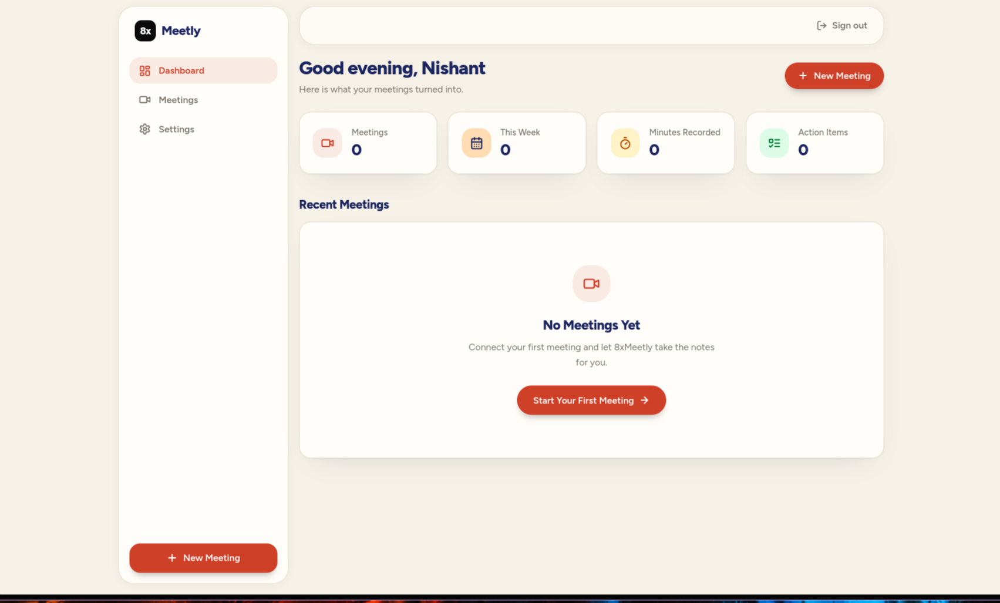</image><image name=[Image #2] path="/tmp/codex-clipboard-iDALvj.png">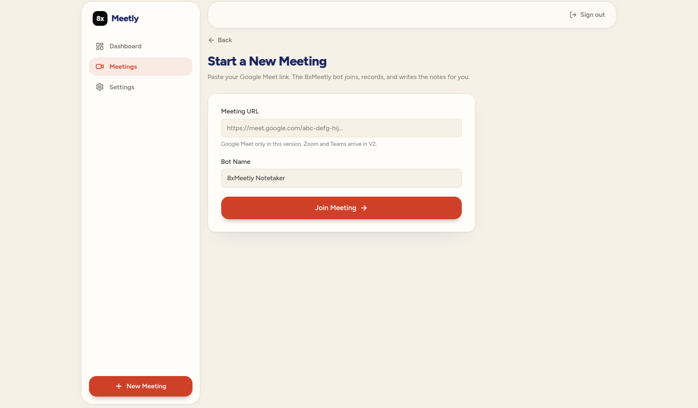</image>[Image #1][Image #2] make the dashbaord and all teh compoenebnts mreo refined and goo ux and ui polish whoel frtoned till now and also define rules


[LOG_ENTRY type=RESPONSE num=1 session=01a0f44e-4a10-7962-ba3b-941f2ac71126]
timestamp: 2026-09-30T21:59:18.230Z
model: gpt-6-luna
source_message_id: msg_08f63ce8234dd12c016abd8633ebe487d0842aaed397abd144

Polished the dashboard and the rest of the frontend: consistent typography, spacing, cards, controls, navigation, and mobile layouts across meetings, transcripts, AI Q&A, settings, sign-in, sign-up, and the landing page.

Dashboard stats now use the full meeting history while the recent list still shows up to ten meetings. Added interface rules for color, layout, accessibility, interactions, and empty states in [DESIGN.md](/home/dawgdevv/Work/8xMeetly/DESIGN.md).

`git diff --check` passed. I did not run tests or lint.


[LOG_ENTRY type=PROMPT num=3 session=01a0f44e-4a10-7962-ba3b-941f2ac71126]
timestamp: 2026-09-30T22:05:41.031Z
model: gpt-6-luna
source_message_id: msg_01a0f45a-1b27-7bb3-8c93-c932a250e9cb

now build user profile these are things in the setting diaply user prifle image name and email Name

Not set

Email

Not signed in

Plan

Starter — unlimited meetings during beta


[LOG_ENTRY type=RESPONSE num=2 session=01a0f44e-4a10-7962-ba3b-941f2ac71126]
timestamp: 2026-09-30T22:06:49.888Z
model: gpt-6-luna
source_message_id: msg_08f63ce8234dd12c016abd87f8136c87d09c0c64db8e4c2f8f

Settings now has a profile card showing the user’s Google profile photo, name, and email. It falls back to initials when no photo is available and uses the email name when Google doesn’t provide a profile name. The Starter plan remains visible in its own card.

`git diff --check` passed; I didn’t run tests. Updated [settings/page.tsx](/home/dawgdevv/Work/8xMeetly/app/dashboard/settings/page.tsx).


[LOG_ENTRY type=PROMPT num=4 session=01a0f44e-4a10-7962-ba3b-941f2ac71126]
timestamp: 2026-09-30T22:09:38.723Z
model: gpt-6-luna
source_message_id: msg_01a0f45d-bba3-7892-b566-a05de0b4dd92

<image name=[Image #1] path="/tmp/codex-clipboard-pobMq0.png">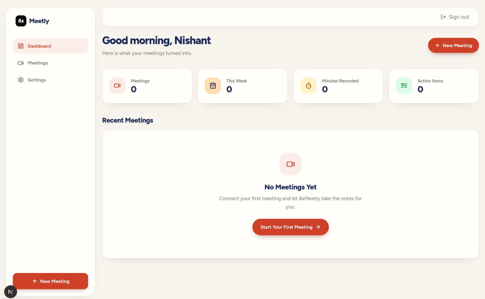</image>add account around the signout [Image #1]can amek this better


[LOG_ENTRY type=RESPONSE num=3 session=01a0f44e-4a10-7962-ba3b-941f2ac71126]
timestamp: 2026-09-30T22:10:27.478Z
model: gpt-6-luna
source_message_id: msg_08f63ce8234dd12c016abd88d28c7887d0a4c91e4b05f87d56

Added an account control beside **Sign out** with the user’s photo or initials and name. It links to Settings and collapses to just the avatar on mobile. `git diff --check` passed; tests weren’t run.


[LOG_ENTRY type=PROMPT num=5 session=01a0f44e-4a10-7962-ba3b-941f2ac71126]
timestamp: 2026-09-30T22:10:53.608Z
model: gpt-6-luna
source_message_id: msg_01a0f45e-e028-7802-af2c-751fc1fe19be

<image name=[Image #1] path="/tmp/codex-clipboard-xMqkIq.png"></image>[Image #1] can you make this better designed search the internt for rerences r desig guide lines


[LOG_ENTRY type=RESPONSE num=4 session=01a0f44e-4a10-7962-ba3b-941f2ac71126]
timestamp: 2026-09-30T22:14:05.943Z
model: gpt-6-luna
source_message_id: msg_08f63ce8234dd12c016abd89a9fa0887d09859d4e0b579a5b8

Reworked the first-run dashboard into a focused welcome state: it hides zero-value metric cards, removes the duplicate heading CTA, and gives users one clear **Start Your First Meeting** action. The empty state now explains what Meetly does and adapts from a compact mobile layout to a two-column desktop layout. Metrics and the heading action return once meetings exist.

I recorded the design references in [DESIGN.md](/home/dawgdevv/Work/8xMeetly/DESIGN.md). The changes follow [Carbon’s empty-state guidance](https://www.carbondesignsystem.com/building-blocks/core/patterns/empty-states) for clear context and next steps, and [Material’s adaptive layout guidance](https://developer.android.com/codelabs/adaptive-material-guidance) for adapting to screen width. [GOV.UK focus-state guidance](https://design-system.service.gov.uk/get-started/focus-states/) is also included in the project rules.

`git diff --check` passed. I didn’t run tests.


[LOG_ENTRY type=PROMPT num=6 session=01a0f44e-4a10-7962-ba3b-941f2ac71126]
timestamp: 2026-09-30T22:14:06.262Z
model: gpt-6-luna
source_message_id: msg_01a0f461-d0b6-70f3-949f-75a54c034d84

<image name=[Image #1] path="/tmp/codex-clipboard-qY1C0a.png">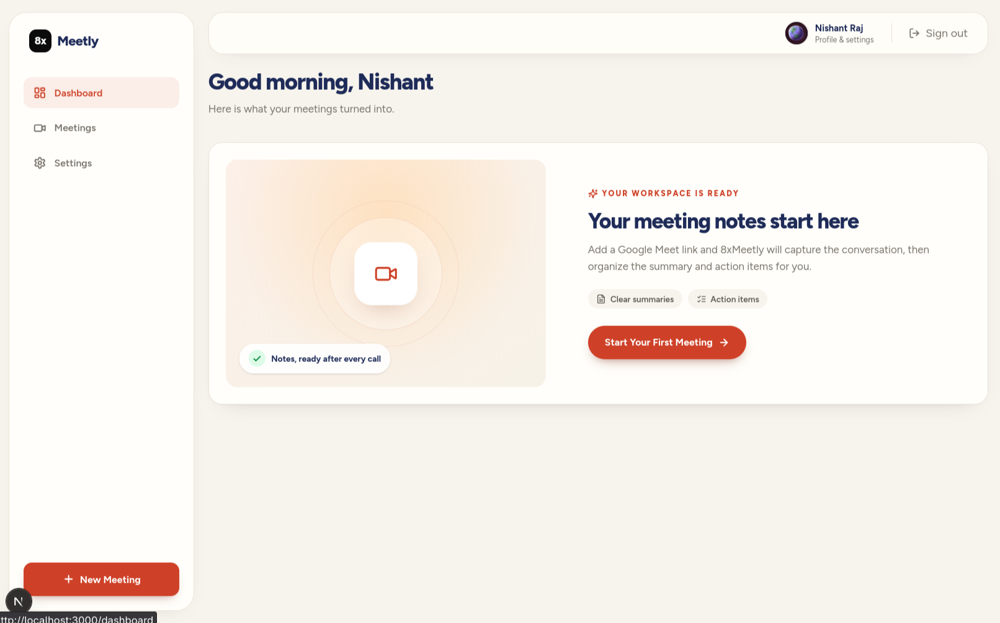</image>[Image #1] now this


[LOG_ENTRY type=RESPONSE num=5 session=01a0f44e-4a10-7962-ba3b-941f2ac71126]
timestamp: 2026-09-30T22:14:50.108Z
model: gpt-6-luna
source_message_id: msg_08f63ce8234dd12c016abd89d8e9b487d08c9ec7532df31dac

The updated screen now has a clearer first-run flow: the account chip is visible, the zero-value stats are gone, and the welcome card has one main action. The **N** badge at the lower left appears to be the Next.js development indicator, rather than part of the dashboard UI.


[LOG_ENTRY type=PROMPT num=7 session=01a0f44e-4a10-7962-ba3b-941f2ac71126]
timestamp: 2026-09-30T23:00:15.767Z
model: gpt-6-luna
source_message_id: msg_01a0f48c-1317-7f62-b5d0-eb2d63d18126

<image name=[Image #1] path="/tmp/codex-clipboard-WMoZnF.png">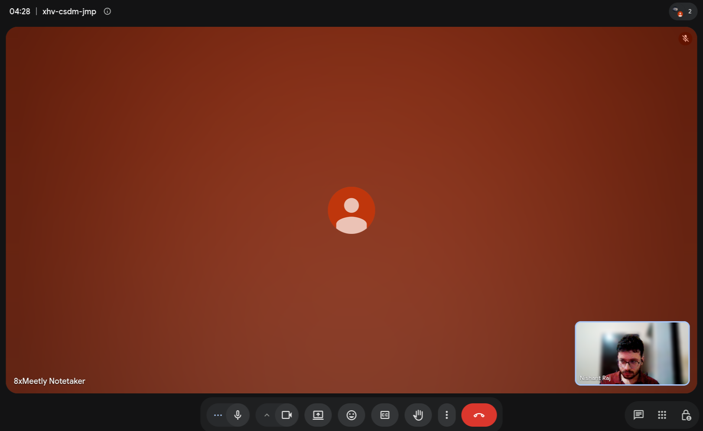</image><image name=[Image #2] path="/tmp/codex-clipboard-7piB6T.png">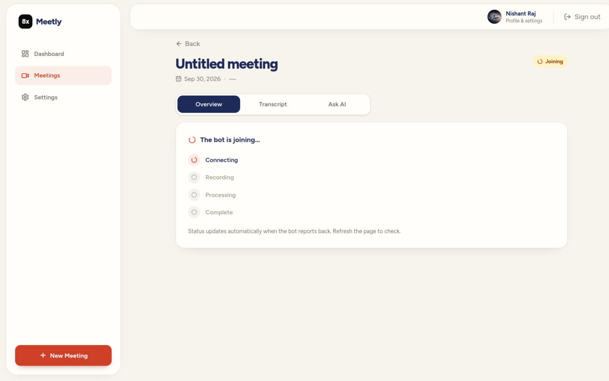</image>[Image #1][Image #2] bot has joined but status is not changing use @App-6a314a73f8ac819195b0d55e36b9c609 for internet ascess [{"idx":0,"id":"4577acf1-25c7-4575-8f74-c6ac65f73219","user_id":"ede77b39-74cc-43cf-be30-ffa02d4bf953","title":null,"meeting_url":"https://meet.google.com/xhv-csdm-jmp","bot_id":"53ecd857-411d-4761-a758-e5ad78ac00dc","status":"joining","started_at":null,"ended_at":null,"duration_seconds":null,"recording_url":null,"transcript_status":null,"summary_status":null,"created_at":"2026-09-30 22:55:38.545139+00","updated_at":"2026-09-30 22:55:38.545139+00"}] this is the current status in database debug it


[LOG_ENTRY type=RESPONSE num=6 session=01a0f44e-4a10-7962-ba3b-941f2ac71126]
timestamp: 2026-09-30T23:17:13.435Z
model: gpt-6-luna
source_message_id: msg_08f63ce8234dd12c016abd9874a40487d0b07408c4b19d2893

The live bot lookup shows this bot **joined, then completed normally**. Its status remained `joining` only in your database; the provider returned no transcript artifact. The app had two gaps: it treated “joined but not recording” as “joining,” and its webhook handler ignored some database update errors. I can’t tell from the row alone whether the completion webhook was missed or a database write failed.

I added:

- A separate **In meeting** state, automatic provider status sync while the meeting page is open, and webhook write-error reporting.
- A migration to allow `in_meeting` in the database.
- Transcription enabled for new bots. Meeting BaaS v2 leaves it off by default. [Create Bot docs](https://docs.meetingbaas.com/api-v2/reference/bots/create-bot)
- A clear completed state when the provider has no transcript to return.

After applying the migration and running the updated app, opening this meeting should sync its completed status and timing into the database. The provider’s lifecycle codes distinguish joining, in-call, and completed states. [Meeting BaaS status events](https://docs.meetingbaas.com/api/getting-started/getting-the-data)

`git diff --check` passed. I did not run tests.


[LOG_ENTRY type=PROMPT num=8 session=01a0f44e-4a10-7962-ba3b-941f2ac71126]
timestamp: 2026-09-30T23:19:17.267Z
model: gpt-6-luna
source_message_id: msg_01a0f49d-7e13-7012-bd66-a3deb6bad9ce

now when i click on the metting it gives me overview transcitp and ask ai so make this weel degined with complete states for the ui update this check thsi


[LOG_ENTRY type=RESPONSE num=7 session=01a0f44e-4a10-7962-ba3b-941f2ac71126]
timestamp: 2026-09-30T23:26:52.646Z
model: gpt-6-luna
source_message_id: msg_08f63ce8234dd12c016abd9aba739087d0a183c2bd97369672

Updated the meeting workspace across **Overview**, **Transcript**, and **Ask AI** with one shared header and tab bar, meeting metadata, status badge, and transcript count.

Each section now handles live, processing, completed, missing-transcript, and failed states. Transcript results reveal 50 segments at a time; Ask AI includes prompt suggestions, loading and error states, and a clearer answer view.

`git diff --check` passed. Lint reported no errors; it found one unrelated existing warning in `app/dashboard/page.tsx`. I didn’t run tests.


[LOG_ENTRY type=PROMPT num=9 session=01a0f44e-4a10-7962-ba3b-941f2ac71126]
timestamp: 2026-10-02T07:28:21.817Z
model: gpt-6-luna
source_message_id: msg_01a0fb83-9d38-7482-a7dd-331a4696683c

<environment_context>
  <current_date>2026-10-02</current_date>
  <timezone>Asia/Kolkata</timezone>
  <filesystem><workspace_roots><root>/home/dawgdevv/Work/8xMeetly</root></workspace_roots><permission_profile type="managed"><file_system type="restricted"><entry access="read"><special>:root</special></entry><entry access="write"><path>/home/dawgdevv/Work/8xMeetly</path></entry><entry access="write"><special>:slash_tmp</special></entry><entry access="write"><special>:tmpdir</special></entry><entry access="read"><path>/home/dawgdevv/Work/8xMeetly/.git</path></entry><entry access="read"><path>/home/dawgdevv/Work/8xMeetly/.agents</path></entry><entry access="read"><path>/home/dawgdevv/Work/8xMeetly/.codex</path></entry><entry access="read"><path>/home/dawgdevv/Work/8xMeetly/.aws</path></entry></file_system></permission_profile></filesystem>
</environment_context>


[LOG_ENTRY type=PROMPT num=10 session=01a0f44e-4a10-7962-ba3b-941f2ac71126]
timestamp: 2026-10-02T07:28:21.918Z
model: gpt-6-luna
source_message_id: msg_01a0fb83-9d9e-7f70-8734-d8e6308704c5

Meeting BaaS join failed (400): {"success":false,"error":"Error","code":"FST_ERR_VALIDATION","statusCode":400,"message":"body/transcription_config transcription_config is required when transcription_enabled is true"} Try again in a moment.


[LOG_ENTRY type=RESPONSE num=8 session=01a0f44e-4a10-7962-ba3b-941f2ac71126]
timestamp: 2026-10-02T07:29:22.550Z
model: gpt-6-luna
source_message_id: msg_08f63ce8234dd12c016abf5d5042d087d0b9da28871e92ddba

Fixed the join payload in [client.ts](/home/dawgdevv/Work/8xMeetly/lib/meeting-baas/client.ts): it now sends `transcription_config: { provider: "gladia" }` alongside `transcription_enabled: true`, matching Meeting BaaS’s [transcription setup](https://docs.meetingbaas.com/api-v2/transcription).

`git diff --check` and ESLint on the changed file passed. The next join attempt will use the corrected payload.


[LOG_ENTRY type=PROMPT num=11 session=01a0f44e-4a10-7962-ba3b-941f2ac71126]
timestamp: 2026-10-02T07:37:31.557Z
model: gpt-6-luna
source_message_id: msg_01a0fb8c-00a5-7c22-a2c2-f7dd7188de7b

so how e can make every thing faster connection transcription auotmatically joins google meet assciated with email id how to make autopmousmus picks up thing from my calander


[LOG_ENTRY type=PROMPT num=12 session=01a0f44e-4a10-7962-ba3b-941f2ac71126]
timestamp: 2026-10-02T08:24:01.269Z
model: gpt-6-luna
source_message_id: msg_01a0fbb6-91f5-7bf0-b41c-dcc6bbdd468b

now we can join meeting bot transcription is laoding but the ui is dealyed check  if delay is on ui side or transcript is not real time we need it follow up qucikly and emit events quickly check where is the bottle neck and code is stuck


[LOG_ENTRY type=PROMPT num=13 session=01a0f44e-4a10-7962-ba3b-941f2ac71126]
timestamp: 2026-10-02T08:30:05.690Z
model: gpt-6-luna
source_message_id: msg_01a0fbbc-217a-77f3-9068-a0b683e43dc4

<send_user_message_question_reply>
[{"answer":"Vercel / serverless","question":"Where is the app deployed? Real-time transcription needs a public, long-lived `wss://` endpoint, so the hosting choice determines how to wire it.","questionItemId":"[\"request_user_input_async\",\"call_WblyrDP9mDtXVtcWbGLg56es\",0]"}]
</send_user_message_question_reply>


[LOG_ENTRY type=RESPONSE num=9 session=01a0f44e-4a10-7962-ba3b-941f2ac71126]
timestamp: 2026-10-02T08:40:26.420Z
model: gpt-6-luna
source_message_id: msg_08f63ce8234dd12c016abf6df2fe1887d09ca563c02d224556

### What was causing the delay

The original bot request enabled **post-meeting transcription**. The webhook saved the transcript when `bot.completed` arrived, so captions weren’t reaching the app during the call. The UI also refreshed for every transcript database event, and the overview hid transcript text while notes were processing.

### Changes made

I added a live transcript receiver that saves interim and final captions, enabled it in new bot requests when configured, and updated the meeting pages to show transcript text as it arrives. UI refreshes are now throttled to prevent a burst of events from triggering a burst of page refreshes. I also fixed a failure path where missing or failed AI note generation could leave a meeting stuck in `processing`.

The Meeting BaaS docs describe streaming captions over a WebSocket separately from post-call transcript artifacts. [Streaming documentation](https://docs.meetingbaas.com/api-v2/streaming)

### To turn on live captions

Vercel can’t host the persistent WebSocket receiver, so the receiver needs to run on an always-on Docker host. The setup notes are in [the live transcript README](/home/dawgdevv/Work/8xMeetly/services/live-transcript/README.md).

1. Deploy the receiver and configure its Supabase credentials and stream secret.
2. Apply [migration 0004](/home/dawgdevv/Work/8xMeetly/supabase/migrations/0004_live_transcript_segment_keys.sql).
3. Set `MEETING_BAAS_STREAMING_URL` in Vercel to the receiver’s `wss://` URL, including the encoded stream token, then redeploy.

Until those steps are done, new meetings will continue using post-call transcription.

TypeScript, targeted ESLint, WebSocket service syntax, and `git diff --check` all passed. I haven’t verified an end-to-end live stream; that requires deploying the receiver and testing a new meeting.


[LOG_ENTRY type=PROMPT num=14 session=01a0f44e-4a10-7962-ba3b-941f2ac71126]
timestamp: 2026-10-02T08:41:41.588Z
model: gpt-6-luna
source_message_id: msg_01a0fbc6-bfd4-7fd3-8a0d-d526e52cf012

i have a vps for it can i deploy on that


[LOG_ENTRY type=PROMPT num=15 session=01a0f44e-4a10-7962-ba3b-941f2ac71126]
timestamp: 2026-10-02T08:42:13.517Z
model: gpt-6-luna
source_message_id: msg_01a0fbc7-3c8d-70b3-a0be-cc4777ede251

no docker vps has 1 gm ram


[LOG_ENTRY type=RESPONSE num=10 session=01a0f44e-4a10-7962-ba3b-941f2ac71126]
timestamp: 2026-10-02T08:43:09.183Z
model: gpt-6-luna
source_message_id: msg_08f63ce8234dd12c016abf6e95614087d0ac61a6daa29c1759

Yes. **A 1 GB VPS should be enough** for this receiver: it handles transcript events, not meeting audio or video. If the VPS is already running other services, leave some memory available for it.

You can run it directly with Node.js 22+ and systemd, then put Caddy or Nginx in front to provide HTTPS/WSS. I added the no-Docker setup steps—including the systemd service, environment file, and Caddy config—to [the deployment README](/home/dawgdevv/Work/8xMeetly/services/live-transcript/README.md). Once it’s running, set `MEETING_BAAS_STREAMING_URL` in Vercel to its `wss://` address.


[LOG_ENTRY type=PROMPT num=16 session=01a0f44e-4a10-7962-ba3b-941f2ac71126]
timestamp: 2026-10-02T09:10:21.445Z
model: gpt-6-luna
source_message_id: msg_01a0fbe0-fe05-7251-8d3e-f5495a71fecd

can we use another language for this


[LOG_ENTRY type=RESPONSE num=11 session=01a0f44e-4a10-7962-ba3b-941f2ac71126]
timestamp: 2026-10-02T09:10:33.361Z
model: gpt-6-luna
source_message_id: msg_08f63ce8234dd12c016abf75077b8087d0bd93e849fc9aaaff

Yes. The WebSocket receiver can be written in any language that supports WebSockets and Supabase writes. **Go** would be a good fit for your 1 GB VPS: it can run as a small standalone binary under systemd. Python would work too, though it wouldn’t offer much advantage over the current Node service for this workload.

If you’re considering another language because of memory, the Node receiver should already be lightweight; changing languages is optional.


[LOG_ENTRY type=PROMPT num=17 session=01a0f44e-4a10-7962-ba3b-941f2ac71126]
timestamp: 2026-10-02T09:11:06.726Z
model: gpt-6-luna
source_message_id: msg_01a0fbe1-aee6-7140-a3bf-f74e6ee413ea

does go will be good or we can run it on node


[LOG_ENTRY type=RESPONSE num=12 session=01a0f44e-4a10-7962-ba3b-941f2ac71126]
timestamp: 2026-10-02T09:11:09.013Z
model: gpt-6-luna
source_message_id: msg_08f63ce8234dd12c016abf752bd22c87d08d7e997d035f6d96

Node is perfectly fine for this receiver. It only handles caption events and writes them to Supabase, so Go likely won’t make a noticeable difference on a 1 GB VPS.

I’d keep the existing Node implementation unless you specifically want Go or already maintain Go services.


[LOG_ENTRY type=PROMPT num=18 session=01a0f44e-4a10-7962-ba3b-941f2ac71126]
timestamp: 2026-10-02T09:20:01.621Z
model: gpt-6-luna
source_message_id: msg_01a0fbe9-d855-7931-b4da-11f75429993d

can you setup a ci cd for this


[LOG_ENTRY type=RESPONSE num=13 session=01a0f44e-4a10-7962-ba3b-941f2ac71126]
timestamp: 2026-10-02T09:22:28.780Z
model: gpt-6-luna
source_message_id: msg_08f63ce8234dd12c016abf77d0a8e487d0b6c8a2701be9be45

I added a GitHub Actions workflow at [deploy-live-transcript.yml](/home/dawgdevv/Work/8xMeetly/.github/workflows/deploy-live-transcript.yml). When changes to the receiver are pushed to `main`, it checks the service syntax, uploads it to your VPS, installs its dependencies, restarts systemd, and checks the health endpoint. You can also run it manually from GitHub Actions.

To enable deployment, add these GitHub Actions secrets: `VPS_HOST`, `VPS_USER`, `VPS_SSH_KEY`, and `VPS_KNOWN_HOSTS`. `VPS_SSH_PORT` is optional. The VPS needs the deployment account, writable app directory, systemd service, and limited restart permission configured as described in the [deployment README](/home/dawgdevv/Work/8xMeetly/services/live-transcript/README.md).

I checked the service syntax and diff formatting. The first VPS deployment will run once those secrets and server permissions are configured and you push the workflow to `main`.


[LOG_ENTRY type=PROMPT num=19 session=01a0f44e-4a10-7962-ba3b-941f2ac71126]
timestamp: 2026-10-02T09:26:22.296Z
model: gpt-6-luna
source_message_id: msg_01a0fbef-a758-7ba0-a005-e3081c790272

❯ ssh -i ~/Documents/oracle-vps-free/ssh-key-2026-07-31.key ubuntu@140.245.200.204 this is my deatiles


[LOG_ENTRY type=RESPONSE num=14 session=01a0f44e-4a10-7962-ba3b-941f2ac71126]
timestamp: 2026-10-02T09:30:16.579Z
model: gpt-6-luna
source_message_id: msg_08f63ce8234dd12c016abf79a3d6b487d0a40fcfbf9fbfe737

Thanks. I verified SSH access: the VPS is Ubuntu 24.04 with Node 22, and `ubuntu` has sudo. I’ve tailored the deployment notes for that host.

In GitHub repository **Settings → Secrets and variables → Actions**, add:

- `VPS_HOST`: `140.245.200.204`
- `VPS_USER`: `ubuntu`
- `VPS_SSH_KEY`: the **contents** of `~/Documents/oracle-vps-free/ssh-key-2026-07-31.key`—don’t paste the key here
- `VPS_KNOWN_HOSTS`: the verified host-key line for this VPS
- `VPS_SSH_PORT`: `22` (optional)

Before the first deployment, the VPS needs the systemd service and environment file configured, plus the app directory writable by `ubuntu` and permission for that account to restart only this service. The [deployment README](/home/dawgdevv/Work/8xMeetly/services/live-transcript/README.md) has those steps.

The workflow is ready in the workspace. It will run after it’s pushed to `main` and the GitHub secrets and VPS setup are in place.


[LOG_ENTRY type=PROMPT num=20 session=01a0f44e-4a10-7962-ba3b-941f2ac71126]
timestamp: 2026-10-02T09:31:21.330Z
model: gpt-6-luna
source_message_id: msg_01a0fbf4-3772-7490-9e25-41ae169e16f7

<image name=[Image #1] path="/tmp/codex-clipboard-ed3K8t.png">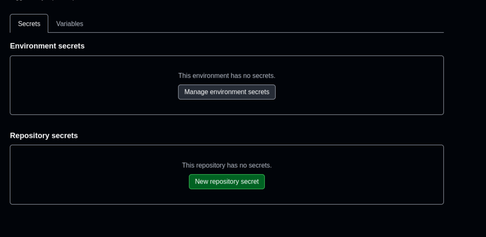</image>[Image #1] in  which space


[LOG_ENTRY type=RESPONSE num=15 session=01a0f44e-4a10-7962-ba3b-941f2ac71126]
timestamp: 2026-10-02T09:31:27.896Z
model: gpt-6-luna
source_message_id: msg_08f63ce8234dd12c016abf79ed903087d0894297133f3a8f5d

Use **Repository secrets**—the lower section in your screenshot. Click **New repository secret** and add each one separately:

- `VPS_HOST` → `140.245.200.204`
- `VPS_USER` → `ubuntu`
- `VPS_SSH_KEY` → the contents of your `.key` file
- `VPS_KNOWN_HOSTS` → the verified host-key line for the VPS

You can skip `VPS_SSH_PORT`; the workflow defaults to port `22`. Don’t paste the private key into this chat.


[LOG_ENTRY type=PROMPT num=21 session=01a0f44e-4a10-7962-ba3b-941f2ac71126]
timestamp: 2026-10-02T09:34:30.793Z
model: gpt-6-luna
source_message_id: msg_01a0fbf7-1b88-71a3-a70b-28db0db1a9a7

with -- beginn private key


[LOG_ENTRY type=RESPONSE num=16 session=01a0f44e-4a10-7962-ba3b-941f2ac71126]
timestamp: 2026-10-02T09:34:36.070Z
model: gpt-6-luna
source_message_id: msg_08f63ce8234dd12c016abf7aaaacb487d08aa980823d6c79bf

Yes. For `VPS_SSH_KEY`, paste the **entire key**, including the `-----BEGIN ... PRIVATE KEY-----` and `-----END ... PRIVATE KEY-----` lines. Keep all line breaks; don’t add quotes or backticks. Save it as a GitHub repository secret, and don’t share it here.


[LOG_ENTRY type=PROMPT num=22 session=01a0f44e-4a10-7962-ba3b-941f2ac71126]
timestamp: 2026-10-02T09:34:57.470Z
model: gpt-6-luna
source_message_id: msg_01a0fbf7-83be-76e0-900d-09b97e5fe628

added


[LOG_ENTRY type=RESPONSE num=17 session=01a0f44e-4a10-7962-ba3b-941f2ac71126]
timestamp: 2026-10-02T09:35:27.446Z
model: gpt-6-luna
source_message_id: msg_08f63ce8234dd12c016abf7adcf23887d09acf6c71b0dadf4b

Great—if you saved it as `VPS_SSH_KEY`, that part is done. Add these remaining repository secrets:

- `VPS_HOST` → `140.245.200.204`
- `VPS_USER` → `ubuntu`
- `VPS_KNOWN_HOSTS` → the output of `ssh-keyscan -p 22 140.245.200.204`

`VPS_SSH_PORT` is optional; it defaults to `22`. The workflow also needs to be pushed to `main`, and the VPS needs its systemd service and restart permission set up before the first deployment.


[LOG_ENTRY type=PROMPT num=23 session=01a0f44e-4a10-7962-ba3b-941f2ac71126]
timestamp: 2026-10-02T09:37:04.196Z
model: gpt-6-luna
source_message_id: msg_01a0fbf9-72c4-7f12-b789-f4e13297fc39

<image name=[Image #1] path="/tmp/codex-clipboard-wnYcHr.png">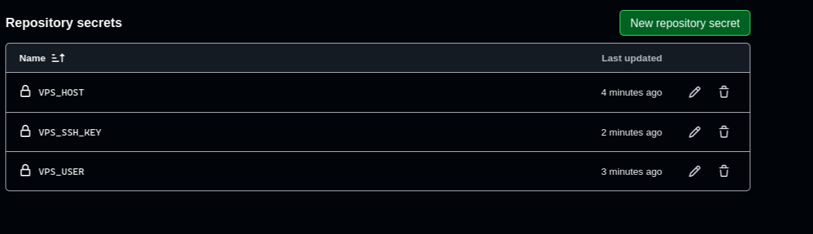</image>[Image #1] now what about .env for vps servicews can i oput it in varibles


[LOG_ENTRY type=RESPONSE num=18 session=01a0f44e-4a10-7962-ba3b-941f2ac71126]
timestamp: 2026-10-02T09:37:22.670Z
model: gpt-6-luna
source_message_id: msg_08f63ce8234dd12c016abf7b4eeaa887d0801cca555b2c49c0

Keep the VPS service’s `.env` values **on the VPS**, in `/etc/8xmeetly-live-transcript.env`. Don’t put them in GitHub **Variables**; the workflow doesn’t transfer those values to the server.

The file needs:

```env
SUPABASE_URL=https://<your-project>.supabase.co
SUPABASE_SERVICE_ROLE_KEY=<your Supabase secret key>
MEETING_BAAS_STREAM_SECRET=<a long random secret>
PORT=8080
```

Keep it private on the VPS (`root:meetly`, mode `640`). Use the same `MEETING_BAAS_STREAM_SECRET` in Vercel’s `MEETING_BAAS_STREAMING_URL` once you have the public `wss://` address.

Your screenshot also shows `VPS_KNOWN_HOSTS` is still missing. Add it as a **repository secret**; the workflow needs it to connect to the VPS securely.


[LOG_ENTRY type=PROMPT num=24 session=01a0f44e-4a10-7962-ba3b-941f2ac71126]
timestamp: 2026-10-02T09:38:44.918Z
model: gpt-6-luna
source_message_id: msg_01a0fbfa-fc36-7691-90b3-98c76f3eeb61

ubuntu@oracle-vps-free:~$ ssh-keyscan -p 22 140.245.200.204
# 140.245.200.204:22 SSH-2.0-OpenSSH_9.6p1 Ubuntu-3ubuntu13.19
140.245.200.204 ssh-rsa AAAAB3NzaC1yc2EAAAADAQABAAABgQD0fpkQnbvqnBJneT+eo4QFrTZek/0MzvSx5hu/shsF/IOfbdahfVHmIYfATiAdLWYE9771+reUAKckWIHOqCTCRSv484T/lxGbgRaKcL7ba9Tiu2vsWuuWDKlZf5yG4mhE1bTbPxJGZPBTmeoWRj13AYtzZJikry+uh6sGZrD89uzRwjWVhcwAD5/gPvon1UsuIAuGZdNUsPET3rzb1cQFMAsZBI6KDtW1q/WxiE4FDrv+hHPVz1Tai5NCO7e5ftchHz43b7aOYbQS0odf2FDcxE2yjtL9NZGVTT8ENrPngFxL+P5KvgELARszbGujLkG4LPBgyeuYl7btZhP+nA8stcWAaMBb2PLIK2hsaK6GQrrQUnmET+DGz//aTDN7zi2NU4ut2FCI0OpuXcB64pbEqEjcHlB5qfCzqfrv/+qqN2gi4nub7fN8xXn7gPeWNnBFHadV/1qPk/AefAJxKC4JdEPVRVmtTlmST7wKe2xPntJe5FxceUI3aLgZYLIlxrE=
# 140.245.200.204:22 SSH-2.0-OpenSSH_9.6p1 Ubuntu-3ubuntu13.19
140.245.200.204 ecdsa-sha2-nistp256 AAAAE2VjZHNhLXNoYTItbmlzdHAyNTYAAAAIbmlzdHAyNTYAAABBBIxV2B9Zl6UxkJECKaqyuDeiMdfa77MC185eBoaxx+SngBPRmXF9FTP4GTyFAw4kxzC/BQ3CnaREEFhTVpNUBi0=
# 140.245.200.204:22 SSH-2.0-OpenSSH_9.6p1 Ubuntu-3ubuntu13.19
140.245.200.204 ssh-ed25519 AAAAC3NzaC1lZDI1NTE5AAAAIKcJym5bSfeEAGNz79WNBPwKsUpBRTq+Kr0QIThDuPVB
# 140.245.200.204:22 SSH-2.0-OpenSSH_9.6p1 Ubuntu-3ubuntu13.19
# 140.245.200.204:22 SSH-2.0-OpenSSH_9.6p1 Ubuntu-3ubuntu13.19
ubuntu@oracle-vps-free:~$


[LOG_ENTRY type=RESPONSE num=19 session=01a0f44e-4a10-7962-ba3b-941f2ac71126]
timestamp: 2026-10-02T09:38:57.593Z
model: gpt-6-luna
source_message_id: msg_08f63ce8234dd12c016abf7baee19087d08bfff0bc700ba25b

Copy the single **`ssh-ed25519` line** into a repository secret named `VPS_KNOWN_HOSTS`:

```text
140.245.200.204 ssh-ed25519 AAAAC3NzaC1lZDI1NTE5AAAAIKcJym5bSfeEAGNz79WNBPwKsUpBRTq+Kr0QIThDuPVB
```

Leave out the `#` comment lines. That’s a public host key, not your private SSH key.


[LOG_ENTRY type=PROMPT num=25 session=01a0f44e-4a10-7962-ba3b-941f2ac71126]
timestamp: 2026-10-02T09:40:44.324Z
model: gpt-6-luna
source_message_id: msg_01a0fbfc-cea4-7360-ad46-36638dd2525a

added


[LOG_ENTRY type=PROMPT num=26 session=01a0f44e-4a10-7962-ba3b-941f2ac71126]
timestamp: 2026-10-02T09:48:39.375Z
model: gpt-6-luna
source_message_id: msg_01a0fc04-0e4f-7670-b419-e8a06a168939

5s
Run set -eu
  set -eu
  archive="/tmp/live-transcript-${GITHUB_SHA}.tar.gz"
  remote_archive="/tmp/live-transcript-${GITHUB_SHA}.tar.gz"
  scp -P "$VPS_PORT" "$archive" "$VPS_USER@$VPS_HOST:$remote_archive"
  ssh -p "$VPS_PORT" "$VPS_USER@$VPS_HOST" \
    "set -eu; \
     install -d /opt/8xmeetly-live-transcript; \
     tar -xzf '$remote_archive' -C /opt/8xmeetly-live-transcript; \
     npm install --omit=dev --no-audit --no-fund --prefix /opt/8xmeetly-live-transcript; \
     sudo -n /usr/bin/systemctl restart 8xmeetly-live-transcript.service; \
     healthy=0; \
     for attempt in 1 2 3 4 5 6 7 8 9 10; do \
       if curl --fail --silent http://127.0.0.1:8080/healthz >/dev/null 2>&1; then healthy=1; break; fi; \
       sleep 2; \
     done; \
     test \"$healthy\" -eq 1; \
     rm -f '$remote_archive'"
  shell: /usr/bin/bash -e {0}
  env:
    SSH_AUTH_SOCK: /tmp/ssh-Zwa0KtUBHjMb/agent.2361
    SSH_AGENT_PID: 2362
    VPS_HOST: ***
    VPS_PORT: 22
    VPS_USER: ***
/home/runner/work/_temp/fb082ef9-3f56-44ba-b563-e95be5d73642.sh: line 5: healthy: unbound variable


[LOG_ENTRY type=RESPONSE num=20 session=01a0f44e-4a10-7962-ba3b-941f2ac71126]
timestamp: 2026-10-02T09:50:51.737Z
model: gpt-6-luna
source_message_id: msg_08f63ce8234dd12c016abf7e77b60087d085551e5b16893cf3

**CI/CD is working.** Both GitHub Actions runs for commit `f240593` succeeded, and the workflow now deploys service changes from `main` to your VPS, restarts systemd, and checks health: [view the successful runs](https://github.com/dawgdevv/8xMeetly/actions/workflows/deploy-live-transcript.yml).

The receiver is active on the VPS, bound to `127.0.0.1:8080`. Its observed memory use was about **38 MiB**.

To enable live captions, it still needs a public `wss://` address with TLS, plus Supabase migration `0004` and the Vercel `MEETING_BAAS_STREAMING_URL` setting. The receiver’s stream secret is stored in the VPS environment file and your local ignored `.env`; don’t share it here. Send me the domain or subdomain you want pointed at the VPS, and I can set up the HTTPS/WSS proxy.


[LOG_ENTRY type=PROMPT num=27 session=01a0f44e-4a10-7962-ba3b-941f2ac71126]
timestamp: 2026-10-02T09:50:51.791Z
model: gpt-6-luna
source_message_id: msg_01a0fc06-138f-79e0-950f-19bf0595e17f

Fix remote health check variable expansion #2


[LOG_ENTRY type=RESPONSE num=21 session=01a0f44e-4a10-7962-ba3b-941f2ac71126]
timestamp: 2026-10-02T09:51:15.389Z
model: gpt-6-luna
source_message_id: msg_08f63ce8234dd12c016abf7e91368c87d094d56cd8e1e1c3c6

That expansion issue is fixed in commit `f240593`: the workflow now escapes `\$healthy` so the remote shell evaluates it after SSH. Both Actions runs for the fix succeeded: [run 36991971706](https://github.com/dawgdevv/8xMeetly/actions/runs/36991971706) and [run 36991971753](https://github.com/dawgdevv/8xMeetly/actions/runs/36991971753).


[LOG_ENTRY type=PROMPT num=28 session=01a0f44e-4a10-7962-ba3b-941f2ac71126]
timestamp: 2026-10-02T09:51:47.178Z
model: gpt-6-luna
source_message_id: msg_01a0fc06-ebea-7ab0-b427-3452e980ea3a

now can we setup caddy for wss url to put it into the vercel


[LOG_ENTRY type=PROMPT num=29 session=01a0f44e-4a10-7962-ba3b-941f2ac71126]
timestamp: 2026-10-02T09:55:02.315Z
model: gpt-6-luna
source_message_id: msg_01a0fc09-e62b-79a1-ac45-a19d4b7809db

inturpt apache


[LOG_ENTRY type=PROMPT num=30 session=01a0f44e-4a10-7962-ba3b-941f2ac71126]
timestamp: 2026-10-02T10:00:25.788Z
model: gpt-6-luna
source_message_id: msg_01a0fc0e-d5bc-7c43-ba27-0ff84b02d54f

i can allow ingress rule


[LOG_ENTRY type=RESPONSE num=22 session=01a0f44e-4a10-7962-ba3b-941f2ac71126]
timestamp: 2026-10-02T10:02:38.442Z
model: gpt-6-luna
source_message_id: msg_08f63ce8234dd12c016abf813c393887d0aab1db5ce4150465

Yes—add an OCI **ingress rule** with:

- **Source CIDR:** `0.0.0.0/0`
- **IP protocol:** TCP
- **Destination port:** `443`
- **Stateless:** No

Keep TCP **80** open for Caddy’s certificate renewal and HTTP redirects. Caddy is configured and its local HTTPS health check passes, but my external check still timed out, so port 443 is not reachable yet. After you add the rule, tell me and I’ll verify it externally.


[LOG_ENTRY type=PROMPT num=31 session=01a0f44e-4a10-7962-ba3b-941f2ac71126]
timestamp: 2026-10-02T10:05:55.910Z
model: gpt-6-luna
source_message_id: msg_01a0fc13-df45-7351-8553-c77953487a2d

<image name=[Image #1] path="/tmp/codex-clipboard-shlI7J.png">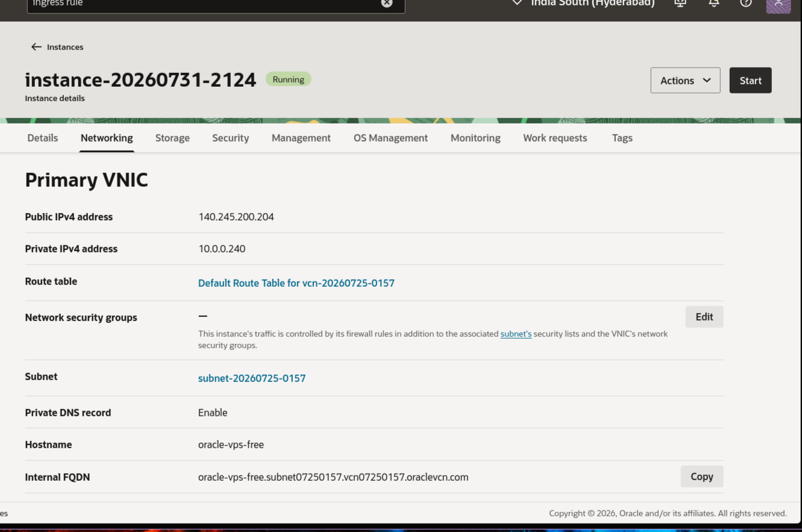</image>[Image #1] can find that seeting


[LOG_ENTRY type=RESPONSE num=23 session=01a0f44e-4a10-7962-ba3b-941f2ac71126]
timestamp: 2026-10-02T10:06:03.984Z
model: gpt-6-luna
source_message_id: msg_08f63ce8234dd12c016abf820a091887d0b1edec4697679f3b

On this screen, click the **subnet-20260725-0157** link. On the subnet page, find **Security Lists** and open the attached default security list. Then choose **Add Ingress Rules** and enter:

- **Source CIDR:** `0.0.0.0/0`
- **IP Protocol:** TCP
- **Destination Port Range:** `443`
- **Stateless:** unchecked

Keep the existing port 80 rule. There are no network security groups attached to this VNIC, so the subnet’s security list is the place to add the rule.


[LOG_ENTRY type=PROMPT num=32 session=01a0f44e-4a10-7962-ba3b-941f2ac71126]
timestamp: 2026-10-02T10:07:31.719Z
model: gpt-6-luna
source_message_id: msg_01a0fc15-5587-7161-b797-b70084cbc51c

added


[LOG_ENTRY type=RESPONSE num=24 session=01a0f44e-4a10-7962-ba3b-941f2ac71126]
timestamp: 2026-10-02T10:10:36.956Z
model: gpt-6-luna
source_message_id: msg_08f63ce8234dd12c016abf831a5dcc87d081cf4a621fa9c498

Port 443 is reachable now: the public check at `https://140.245.200.204/healthz` returns `{"ok":true}`.

Caddy is proxying HTTPS to the transcript service on `127.0.0.1:8080`. I also added and saved the VPS firewall rule so it is restored at startup.

In Vercel, set `MEETING_BAAS_STREAMING_URL` to the value already configured in your local `.env` (`wss://140.245.200.204/transcripts?token=…`) for the right environment, then redeploy. Keep the token private.


[LOG_ENTRY type=PROMPT num=33 session=01a0f44e-4a10-7962-ba3b-941f2ac71126]
timestamp: 2026-10-02T10:11:07.727Z
model: gpt-6-luna
source_message_id: msg_01a0fc18-a14f-7da2-a4df-979068f6076c

what is the token


[LOG_ENTRY type=RESPONSE num=25 session=01a0f44e-4a10-7962-ba3b-941f2ac71126]
timestamp: 2026-10-02T10:11:17.043Z
model: gpt-6-luna
source_message_id: msg_08f63ce8234dd12c016abf83438be887d0bcbf219e2fcd982f

Your stream token is:

`32ea646d73dd1140e12834ecda8dc35c8afd1f3df93c44d898e5814c15a488fe`

Add it to the `token` parameter in Vercel’s `MEETING_BAAS_STREAMING_URL`. Keep it private.


[LOG_ENTRY type=PROMPT num=34 session=01a0f44e-4a10-7962-ba3b-941f2ac71126]
timestamp: 2026-10-02T10:11:32.348Z
model: gpt-6-luna
source_message_id: msg_01a0fc19-017c-7743-b2e5-3ed4be60ecf7

give me eufll steso how to do this


[LOG_ENTRY type=RESPONSE num=26 session=01a0f44e-4a10-7962-ba3b-941f2ac71126]
timestamp: 2026-10-02T10:11:46.615Z
model: gpt-6-luna
source_message_id: msg_08f63ce8234dd12c016abf835d67bc87d0b7ebd8e0e9bdcff6

### Add the streaming URL in Vercel

1. Open **Vercel Dashboard** and select your **8xMeetly** project.
2. Go to **Settings → Environment Variables**.
3. Choose **Add New** and enter:
   - **Key:** `MEETING_BAAS_STREAMING_URL`
   - **Value:**  
     `wss://140.245.200.204/transcripts?token=32ea646d73dd1140e12834ecda8dc35c8afd1f3df93c44d898e5814c15a488fe`
   - **Environment:** Select **Production**. Also select **Preview** if you want preview deployments to use live transcription.
4. Save the variable.
5. Open **Deployments**, find the latest deployment, and choose **Redeploy**. The new value only takes effect in a deployment created after you add it.
6. Once it finishes, start a new meeting and check whether live transcription connects.

Don’t include `MEETING_BAAS_STREAMING_URL=` in the value, and don’t commit this token to GitHub. It must match the stream secret configured on the VPS.


[LOG_ENTRY type=PROMPT num=35 session=01a0f44e-4a10-7962-ba3b-941f2ac71126]
timestamp: 2026-10-02T10:12:36.036Z
model: gpt-6-luna
source_message_id: msg_01a0fc19-fa44-7a20-9dd6-06dbff914149

so it will help multipleuser avcross dofrtent session how this works


[LOG_ENTRY type=RESPONSE num=27 session=01a0f44e-4a10-7962-ba3b-941f2ac71126]
timestamp: 2026-10-02T10:13:45.933Z
model: gpt-6-luna
source_message_id: msg_08f63ce8234dd12c016abf83d2bd3487d09ceb6372348a3754

Yes, the setup can handle multiple users and meetings. **They all use the same streaming URL and service token**; the token authenticates bots connecting to your transcript service, rather than identifying an individual user.

The flow is:

1. A signed-in user starts a meeting in the app.
2. Vercel asks Meeting BaaS to join, passing it the streaming URL from `MEETING_BAAS_STREAMING_URL`.
3. Each bot opens its own WebSocket connection to Caddy on your VPS. Multiple connections can be open at once.
4. The transcript service uses each event’s `bot_id` to find its matching meeting in the database and save the transcript to that meeting.
5. The app uses the signed-in user’s identity and Supabase access rules to show them their meetings and transcripts.

So separate meetings are associated through their bot IDs and meeting records; users don’t get separate stream tokens. The VPS handles the incoming connections and saves transcript events. Meeting BaaS handles the meeting connection and transcription.

The shared token is a service credential, so keep it private. Since it appeared in this chat, rotate it before opening the app to a wider group: update the secret on the VPS and the streaming URL in Vercel, then restart the VPS service and redeploy Vercel.


[LOG_ENTRY type=PROMPT num=36 session=01a0f44e-4a10-7962-ba3b-941f2ac71126]
timestamp: 2026-10-02T10:15:56.443Z
model: gpt-6-luna
source_message_id: msg_01a0fc1d-091b-7ce3-9a59-4c483c8163c3

how to acess files on vps


[LOG_ENTRY type=RESPONSE num=28 session=01a0f44e-4a10-7962-ba3b-941f2ac71126]
timestamp: 2026-10-02T10:16:06.984Z
model: gpt-6-luna
source_message_id: msg_08f63ce8234dd12c016abf8462ccf487d0a0db0e5e8438f792

Open a terminal on your computer and connect with SSH:

```bash
ssh -i ~/Documents/oracle-vps-free/ssh-key-2026-07-31.key ubuntu@140.245.200.204
```

Once connected, you can browse the deployed service files:

```bash
cd /opt/8xmeetly-live-transcript
ls -la
```

The related configuration files are at:

- Caddy: `/etc/caddy/Caddyfile`
- Transcript service environment: `/etc/8xmeetly-live-transcript.env`

Use `sudo nano /etc/caddy/Caddyfile` to edit the Caddy config. The environment file contains secrets, so avoid pasting its contents into chat.

To copy a file from the VPS to your computer, run this **on your computer**:

```bash
scp -i ~/Documents/oracle-vps-free/ssh-key-2026-07-31.key ubuntu@140.245.200.204:/opt/8xmeetly-live-transcript/server.mjs .
```


[LOG_ENTRY type=PROMPT num=37 session=01a0f44e-4a10-7962-ba3b-941f2ac71126]
timestamp: 2026-10-02T10:17:16.872Z
model: gpt-6-luna
source_message_id: msg_01a0fc1e-4348-7231-a742-e04b0683e312

presmisson deined vewing env


[LOG_ENTRY type=RESPONSE num=29 session=01a0f44e-4a10-7962-ba3b-941f2ac71126]
timestamp: 2026-10-02T10:17:30.051Z
model: gpt-6-luna
source_message_id: msg_08f63ce8234dd12c016abf84b75a7487d08bb787058ea7849d

That file is root-protected because it contains credentials. After SSHing into the VPS, use `sudo`:

```bash
sudo less /etc/8xmeetly-live-transcript.env
```

Press `q` to exit. To edit it, use:

```bash
sudo nano /etc/8xmeetly-live-transcript.env
```

If you tried to download it with `scp`, that won’t work directly because `scp` doesn’t run `sudo` on the VPS. Don’t loosen the file permissions; keeping it root-protected is intentional.


[LOG_ENTRY type=PROMPT num=38 session=01a0f44e-4a10-7962-ba3b-941f2ac71126]
timestamp: 2026-10-02T10:19:35.715Z
model: gpt-6-luna
source_message_id: msg_01a0fc20-61a3-7a20-b5b6-824c7b74496b

<image name=[Image #1] path="/tmp/codex-clipboard-I2d489.png">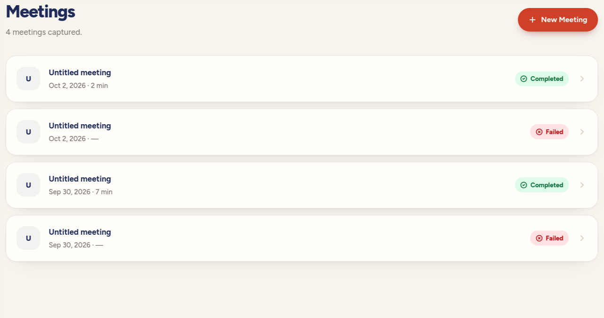</image>[Image #1] now ti gioves unitiled meeting


[LOG_ENTRY type=RESPONSE num=30 session=01a0f44e-4a10-7962-ba3b-941f2ac71126]
timestamp: 2026-10-02T10:21:20.652Z
model: gpt-6-luna
source_message_id: msg_08f63ce8234dd12c016abf859e341487d0bb1dac8ee760aa6e

Meetings were showing “Untitled meeting” because the app saved no title when you pasted a Google Meet link. The link alone doesn’t include the calendar event’s name.

I updated the flow so you can enter an optional **Meeting name** when starting a meeting. If you leave it blank, it uses **Google Meet · [date]**. That fallback also appears for existing untitled meetings across the meeting list and detail tabs.

`git diff --check` passes. I haven’t run the app or tests.


[LOG_ENTRY type=PROMPT num=39 session=01a0f44e-4a10-7962-ba3b-941f2ac71126]
timestamp: 2026-10-02T10:22:07.436Z
model: gpt-6-luna
source_message_id: msg_01a0fc22-b24c-7ee1-b132-29c6a04208cd

now the reatime thing working instant load and all teh stuff when join meeting some it stucls on joinin then sudely it completes


[LOG_ENTRY type=PROMPT num=40 session=01a0f44e-4a10-7962-ba3b-941f2ac71126]
timestamp: 2026-10-02T10:26:27.698Z
model: gpt-6-luna
source_message_id: msg_01a0fc26-aaf2-7722-8839-86fa26b5ce70

does we have to have to change webhook confuig on mettinng bass


[LOG_ENTRY type=RESPONSE num=31 session=01a0f44e-4a10-7962-ba3b-941f2ac71126]
timestamp: 2026-10-02T10:27:38.725Z
model: gpt-6-luna
source_message_id: msg_08f63ce8234dd12c016abf8716a4c087d0bb7cafa2eaac85ea

Yes, if it isn’t already set up. In Meeting BaaS, make sure the account webhook points to:

`https://<your-production-vercel-domain>/api/webhooks/meeting-baas`

Subscribe to `bot.status_change`, `bot.completed`, and `bot.failed`. The live status changes arrive as `bot.status_change`; codes such as `joining_call` and `in_call_recording` are included inside the event payload. [Meeting BaaS status event docs](https://docs.meetingbaas.com/api/getting-started/getting-the-data)

If the webhook settings provide a signing secret, add it to Vercel as `MEETING_BAAS_WEBHOOK_SECRET` and redeploy. If the endpoint and events are already configured, you don’t need to change them.

I also deployed the fallback that marks a meeting as **Recording** when its first live transcript segment arrives. [Deployment succeeded](https://github.com/dawgdevv/8xMeetly/actions/runs/36995482664).


[LOG_ENTRY type=PROMPT num=41 session=01a0f44e-4a10-7962-ba3b-941f2ac71126]
timestamp: 2026-10-02T10:34:07.188Z
model: gpt-6-luna
source_message_id: msg_01a0fc2d-add4-7f21-993d-2421c5d0607a

<image name=[Image #1] path="/tmp/codex-clipboard-lrknkN.png">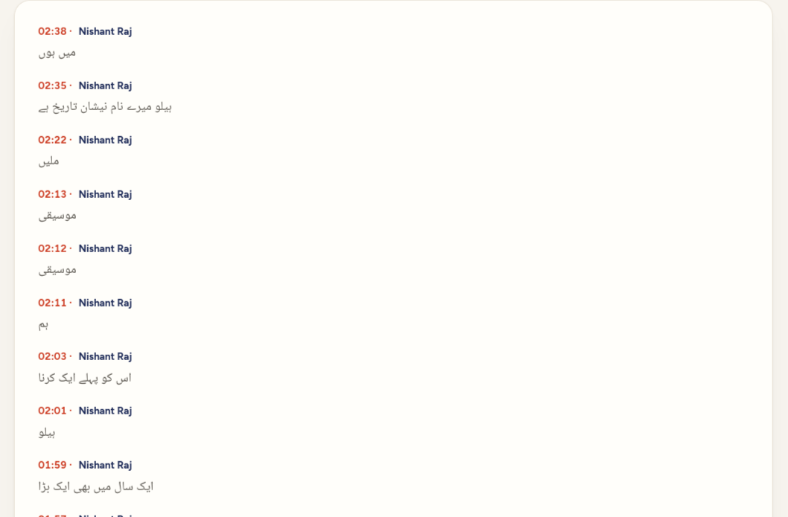</image>[Image #1] tarsncript is not english is enforec it in english


[LOG_ENTRY type=RESPONSE num=32 session=01a0f44e-4a10-7962-ba3b-941f2ac71126]
timestamp: 2026-10-02T10:43:34.177Z
model: gpt-6-luna
source_message_id: msg_08f63ce8234dd12c016abf8ad2be8887d0b34b34bab68c1404

I updated transcription to **detect the spoken language and translate it into English** for both live segments and the final transcript. The existing meeting will keep its Urdu transcript; this configuration applies to **new meetings** created after Vercel deploys the change.

The VPS deployment succeeded, and CI passed lint, type checking, and build. The change is pushed to `main`; Vercel should deploy it automatically if the project is connected to the repository.

The configuration follows Meeting BaaS’s separate settings for batch and live transcription, and Gladia’s English translation options. [Meeting BaaS transcription](https://docs.meetingbaas.com/api-v2/transcription), [Meeting BaaS streaming](https://docs.meetingbaas.com/api-v2/streaming), [Gladia translation](https://docs.gladia.io/chapters/audio-intelligence/translation).


[LOG_ENTRY type=PROMPT num=42 session=01a0f44e-4a10-7962-ba3b-941f2ac71126]
timestamp: 2026-10-02T10:43:34.323Z
model: gpt-6-luna
source_message_id: msg_01a0fc36-5533-7932-914b-86fd1ea684af

<image name=[Image #1] path="/tmp/codex-clipboard-TihXtq.png">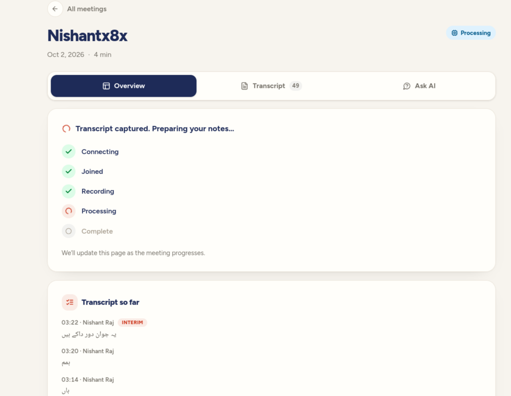</image>[Image #1] it is also processing undefinetly


[LOG_ENTRY type=PROMPT num=43 session=01a0f44e-4a10-7962-ba3b-941f2ac71126]
timestamp: 2026-10-02T10:46:05.525Z
model: gpt-6-luna
source_message_id: msg_01a0fc38-a3d5-7270-966c-d1c94c607db5

i think thisbia ui problem some thing is stuck in network call


[LOG_ENTRY type=RESPONSE num=33 session=01a0f44e-4a10-7962-ba3b-941f2ac71126]
timestamp: 2026-10-02T10:50:59.599Z
model: gpt-6-luna
source_message_id: msg_08f63ce8234dd12c016abf8c907b6487d08eeac77ce0fcc993

Your network-call suspicion was partly right. The UI could overlap slow status requests, and the OpenAI notes request had no explicit timeout. The bigger issue was that status reconciliation could see a completed bot and still leave the meeting in **Processing** without finalizing its transcript.

I updated reconciliation to finalize completed meetings, fall back to saved live transcript segments if the provider artifact can’t be fetched, and retry a summary job if it gets stuck. I also bounded OpenAI requests and prevented overlapping UI polls.

Lint and TypeScript checks pass. Lint reports one unrelated existing warning in [app/dashboard/page.tsx](/home/dawgdevv/Work/8xMeetly/app/dashboard/page.tsx:52). Once this change is deployed, the page should reconcile the stuck meeting on its next poll.


[LOG_ENTRY type=PROMPT num=44 session=01a0f44e-4a10-7962-ba3b-941f2ac71126]
timestamp: 2026-10-02T10:56:43.008Z
model: gpt-6-luna
source_message_id: msg_01a0fc42-5e00-7140-ac8f-80bea30234ff

now the the metting that stucvkle how to make that corect


[LOG_ENTRY type=RESPONSE num=34 session=01a0f44e-4a10-7962-ba3b-941f2ac71126]
timestamp: 2026-10-02T10:57:51.961Z
model: gpt-6-luna
source_message_id: msg_08f63ce8234dd12c016abf8e2dd4a887d09abb2cac266a4855

The recovery fix is in commit `e421fb8` on `main`. After its Vercel deployment finishes, open the stuck meeting and refresh the page. Its first status check should reuse the saved transcript, finish the notes, and move the meeting to **Completed**.

Don’t manually change the meeting’s database status; that could hide the recovery path. If it’s still processing after the deployment and a refresh, check the Vercel function logs for that meeting’s `sync-status` request.


[LOG_ENTRY type=PROMPT num=45 session=01a0f44e-4a10-7962-ba3b-941f2ac71126]
timestamp: 2026-10-02T11:00:39.614Z
model: gpt-6-luna
source_message_id: msg_01a0fc45-fa3e-7850-a486-20199150e56e

it doesnt gets update d


[LOG_ENTRY type=RESPONSE num=35 session=01a0f44e-4a10-7962-ba3b-941f2ac71126]
timestamp: 2026-10-02T11:03:05.707Z
model: gpt-6-luna
source_message_id: msg_08f63ce8234dd12c016abf8f679dc887d0a2a0763c4a416529

I pushed a follow-up fix as `d060e01`. It finalizes the saved transcript before calling Meeting BaaS, so a slow provider status request can’t block recovery.

Once the Vercel deployment for that commit is ready, reopen the stuck meeting and refresh. The page will retry automatically; it should use the transcript already saved for that meeting. I couldn’t verify the CI run here because the local GitHub CLI couldn’t start in the read-only environment.


[LOG_ENTRY type=PROMPT num=46 session=01a0f44e-4a10-7962-ba3b-941f2ac71126]
timestamp: 2026-10-02T11:04:12.145Z
model: gpt-6-luna
source_message_id: msg_01a0fc49-3870-74f1-b46b-ce1429fb50ee

yes it got completed


[LOG_ENTRY type=RESPONSE num=36 session=01a0f44e-4a10-7962-ba3b-941f2ac71126]
timestamp: 2026-10-02T11:04:15.343Z
model: gpt-6-luna
source_message_id: msg_08f63ce8234dd12c016abf8faeb3e487d092736ce015767245

Great—the recovery flow finalized the saved transcript and moved the meeting to Completed.


[LOG_ENTRY type=PROMPT num=47 session=01a0f44e-4a10-7962-ba3b-941f2ac71126]
timestamp: 2026-10-02T11:08:56.413Z
model: gpt-6-luna
source_message_id: msg_01a0fc4d-8edd-7fe1-959c-b21dce11e505

so now when i log back in it greets on landiong page but it shoudl redirect to dashbaord if i am loged in into it


[LOG_ENTRY type=RESPONSE num=37 session=01a0f44e-4a10-7962-ba3b-941f2ac71126]
timestamp: 2026-10-02T11:09:55.639Z
model: gpt-6-luna
source_message_id: msg_08f63ce8234dd12c016abf910212d887d0b0a7f2157d971f5e

Signed-in users now redirect from `/` to `/dashboard`; signed-out visitors still see the landing page. The fix is pushed to `main` as `be82e03`. After the Vercel deployment finishes, logging in should take you straight to the dashboard.

Lint and TypeScript checks pass; lint still reports one unrelated warning.


[LOG_ENTRY type=PROMPT num=48 session=01a0f44e-4a10-7962-ba3b-941f2ac71126]
timestamp: 2026-10-02T11:10:40.790Z
model: gpt-6-luna
source_message_id: msg_01a0fc4f-2695-78d1-929e-3e29094fd447

now we have to enter alink if it is connected to my goole can we automaticaly detect the metting and enter in how read ai does that


[LOG_ENTRY type=RESPONSE num=38 session=01a0f44e-4a10-7962-ba3b-941f2ac71126]
timestamp: 2026-10-02T11:12:47.281Z
model: gpt-6-luna
source_message_id: msg_08f63ce8234dd12c016abf91a8094c87d09bf1900cad1df94e

Yes. 8xMeetly can find scheduled Google Meet calls in your calendar and send the bot automatically, similar to Read AI’s calendar auto-join feature.

Right now, signing in with Google only identifies your account. The app doesn’t request Calendar access or sync events, so it can’t see your meetings yet. Read AI’s public docs describe an auto-join switch, filters such as “events I host,” and per-meeting join controls; they don’t disclose all of their internal scheduling details. [Read AI auto-join settings](https://support.read.ai/hc/en-us/articles/15107064280851-I-don-t-want-Read-to-join-all-my-meetings-what-are-my-options)

For 8xMeetly, the flow would be:

1. Add a separate **Connect Google Calendar** permission using read-only event access. Calendar event access is a sensitive Google OAuth scope, so publishing the integration may require Google verification. [Google Calendar scopes](https://developers.google.com/workspace/calendar/api/auth)
2. Sync upcoming events and identify the ones with Google Meet links. Google Calendar supports event listing and change notifications; notifications tell us to sync changes, while a scheduler checks when it’s time to join. [List events](https://developers.google.com/workspace/calendar/api/v3/reference/events/list), [Calendar push notifications](https://developers.google.com/workspace/calendar/api/guides/push)
3. Add an **Auto-join scheduled meetings** setting and per-event join/skip controls. When enabled, 8xMeetly dispatches the Meeting BaaS bot near the event start time.

The current Google sign-in isn’t enough for this; we need the Calendar permission, secure token storage, and a scheduler. A sensible first version would only join events with Meet links, with auto-join off until the user enables it.


[LOG_ENTRY type=PROMPT num=49 session=01a0f44e-4a10-7962-ba3b-941f2ac71126]
timestamp: 2026-10-02T11:21:04.036Z
model: gpt-6-luna
source_message_id: msg_01a0fc58-a924-7533-a54c-37e3d7c525e6

now e have to puslish the agent logs


[LOG_ENTRY type=RESPONSE num=39 session=01a0f44e-4a10-7962-ba3b-941f2ac71126]
timestamp: 2026-10-02T11:21:31.760Z
model: gpt-6-luna
source_message_id: msg_08f63ce8234dd12c016abf93ba105c87d0826136699c8655c1

I need to know which “publish” you mean before taking the next step: publish Google Calendar access for the app, or make meeting bot logs/transcripts public?


[LOG_ENTRY type=PROMPT num=50 session=01a0f44e-4a10-7962-ba3b-941f2ac71126]
timestamp: 2026-10-02T11:22:00.749Z
model: gpt-6-luna
source_message_id: msg_01a0fc59-86ac-7d53-887d-4361fe8d7e43

no there .agent-logs how to append this


[LOG_ENTRY type=PROMPT num=51 session=01a0f44e-4a10-7962-ba3b-941f2ac71126]
timestamp: 2026-10-02T11:22:35.181Z
model: gpt-6-luna
source_message_id: msg_01a0fc5a-0d2c-7663-be6e-9d6d03b49168

# 8x Assignment — Agent Capture Setup

Paste this entire file into your coding agent as your **first message**, before any
other work on the assignment. Do not start building until the check in step 4 passes.

We are not checking whether you used AI. We assume you did. We are checking *how* you
work with it, and the only way to see that is the raw prompt-and-response record.

---

## 1. Identify your setup

State, in your first reply:

- The tool you are using (Claude Code, Cursor, Codex CLI, Windsurf, Aider, other)
- The exact model or models, including which one plans and which one executes
- Whether that tool has a hook, lifecycle-event, or rules mechanism that can run a
  command automatically on every prompt and every response

If you do not know whether your tool has one, look it up before answering. Do not
guess, and do not fall back to manual logging until you have checked.

---

## 2. Install the capture hook

Set up automatic capture for your tool. **Whatever the mechanism, it must fire on its
own.** If you have to remember to run it, it is wrong.

Roughly, by tool:

- **Claude Code** — hooks in `.claude/settings.json` in the repo. Wire the prompt event
  and the end-of-turn event to a script that appends to the log. The end-of-turn hook
  receives a path to the session transcript on stdin.
- **Cursor / Windsurf** — a project rules file, plus whatever export or history
  mechanism the app provides. Check whether the app writes a session store on disk you
  can read from.
- **Codex CLI / Aider / other** — check for a session log, a transcript flag, or a
  config hook. Most write a session file somewhere; find it and extract from it.

If your tool genuinely has no automatic mechanism, say so explicitly, name what you
checked, and wrap the session instead. Saying "my tool cannot do this" without having
checked is the wrong answer.

---

## 3. What to capture

Write captures to `.agent-logs/` in the repo root. These are committed and ship with
your repo, publicly, so treat them as part of the submission.

**We want the prompt and the final response. Nothing in between.**

Not the thinking. Not the tool calls. Not the intermediate steps, the file reads, the
diffs, or the retries the model made on its own. Just: what you asked, and what came
back at the end of that turn.

Capture, per turn:

- The prompt, verbatim and in full. No truncation, no paraphrase, no cleanup.
- The final response for that prompt, in full, including the ones where it got it wrong.
- A UTC timestamp.
- The model name, so a switch mid-build is visible.

Do not:

- Add `.agent-logs/` to `.gitignore`. It ships with the repo.
- Edit, tidy, summarise, or delete an entry after the fact. A messy honest log scores
  better than a clean one, and we can tell the difference.

Commit the logs as you go, interleaved with the code they produced, not in one dump at
the end. The commit order shows the order you actually worked in.

### Format

Match this. It is the format we use internally, so it is the one we can read fastest.
One file per session, named `YYYY-MM-DD_HH-MM-SS_<session-id>.md`.

    ---
    session_id: 3f9c1a20-77bd-4e51-9a0e-1c2f83b4de77
    date: 2026-08-28
    author: your-github-handle
    model: claude-opus-5
    tool: claude-code
    project: naano-rebuild
    total_exchanges: 34
    first_prompt_time: 2026-08-28T09:14:02.118Z
    last_prompt_time: 2026-08-28T21:47:35.902Z
    ---

    # Session Log - 2026-08-28

    Session: `3f9c1a20` | Project: `naano-rebuild` | Author: `your-github-handle`

    ---

    [LOG_ENTRY type=PROMPT num=1 session=3f9c1a20]
    timestamp: 2026-08-28T09:14:02.118Z
    model: claude-opus-5

    Read the screenshots in /recon and map out the two sides of the product before
    writing any code. I want the data model first.


    [LOG_ENTRY type=RESPONSE num=1 session=3f9c1a20]
    timestamp: 2026-08-28T09:15:40.663Z
    model: claude-opus-5

    There are two distinct roles and they barely share a surface...


    [LOG_ENTRY type=PROMPT num=2 session=3f9c1a20]
    timestamp: 2026-08-28T09:31:11.204Z
    model: claude-opus-5

    The brief builder is wrong. A brand cannot see projected outcomes before
    committing budget, which is the whole point. Redo it.

---

## 4. Verify it works, then prove it

Do not start the assignment until you have done this.

1. Send yourself a canary prompt: `CAPTURE TEST — 8x assignment, <your name>`
2. Confirm the prompt **and** the response both appear in `.agent-logs/`
3. Start a second session, send another canary, and confirm that one lands too. A hook
   that only works in the session that created it is not installed.
4. Create `CAPTURE-TEST.md` in the repo root containing:
   - Your tool and model, from step 1
   - The mechanism you used, and the config file you changed
   - The path to the log file the canaries landed in
   - Both canary entries, pasted raw
   - Anything you tried first that did not work

`CAPTURE-TEST.md` is the first thing we open. If capture is not working the rest of the
submission is not assessable, so get this green before you build anything.

---

## 5. Then build

Once capture is verified, start the assignment in the same repo. Everything from here
is recorded automatically and you can stop thinking about it.

One thing worth knowing: we are not scoring the log for tidiness or for looking
impressive. Dead ends, wrong turns, and the moment you realised the first approach was
wrong are the most useful things in it. Leave them in.


[LOG_ENTRY type=RESPONSE num=40 session=01a0f44e-4a10-7962-ba3b-941f2ac71126]
timestamp: 2026-10-02T11:36:55.949Z
model: gpt-6-luna
source_message_id: msg_08f63ce8234dd12c016abf97543f8487d0b8796c7a95bd671f

**Capture setup is green.** Tool: Codex CLI/TUI 0.159.2. Model: `gpt-6-luna` with high reasoning for both planning and execution. The project uses automatic `UserPromptSubmit` and `Stop` hooks; Codex supports these lifecycle hooks, and I reviewed and trusted the project hooks in the CLI. [Codex hooks documentation](https://developers.openai.com/codex/hooks)

[CAPTURE-TEST.md](/home/dawgdevv/Work/8xMeetly/CAPTURE-TEST.md) contains the setup details, both raw canary exchanges, and the attempts that failed. Each canary’s prompt and final response landed in its own file under `.agent-logs/`. The log directory is not gitignored.

Committed as `70f2b4e` and `b184db4`. The working tree is clean.


[LOG_ENTRY type=PROMPT num=52 session=01a0f44e-4a10-7962-ba3b-941f2ac71126]
timestamp: 2026-10-02T11:39:13.295Z
model: gpt-6-luna
source_message_id: msg_01a0fc69-480f-7531-a679-d9ca0fefe2d5

i forget ot congure this but my assignment is completed can you show me a work around


[LOG_ENTRY type=RESPONSE num=41 session=01a0f44e-4a10-7962-ba3b-941f2ac71126]
timestamp: 2026-10-02T11:40:40.932Z
model: gpt-6-luna
source_message_id: msg_08f63ce8234dd12c016abf9835426087d0951ca5c831f0d5fd

Yes. Codex saved the session transcript, so you can recover the original prompts and final replies from it:

[Saved Codex session transcript](/home/dawgdevv/.codex/sessions/2026/10/01/rollout-2026-10-01T03-22-46-01a0f44e-4a10-7962-ba3b-941f2ac71126.jsonl)

Export only user messages and assistant messages marked `final_answer`, then place them in a separate log labeled **recovered from Codex transcript after completion**. That preserves the original exchange while being clear about when the log was created. The hooks and canaries we set up verify capture for future sessions; they can’t establish that the completed assignment was captured live. If the evaluator requires interleaved, automatic logs, disclose that limitation alongside the recovered log.


[LOG_ENTRY type=PROMPT num=53 session=01a0f44e-4a10-7962-ba3b-941f2ac71126]
timestamp: 2026-10-02T11:41:20.163Z
model: gpt-6-luna
source_message_id: msg_01a0fc6b-37a3-70e1-93a7-a12b2c597bd2

yes then do that


